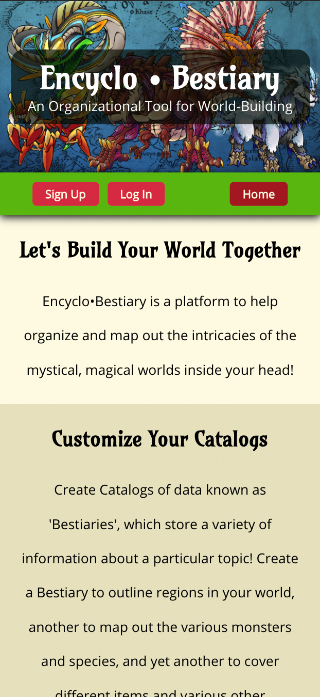
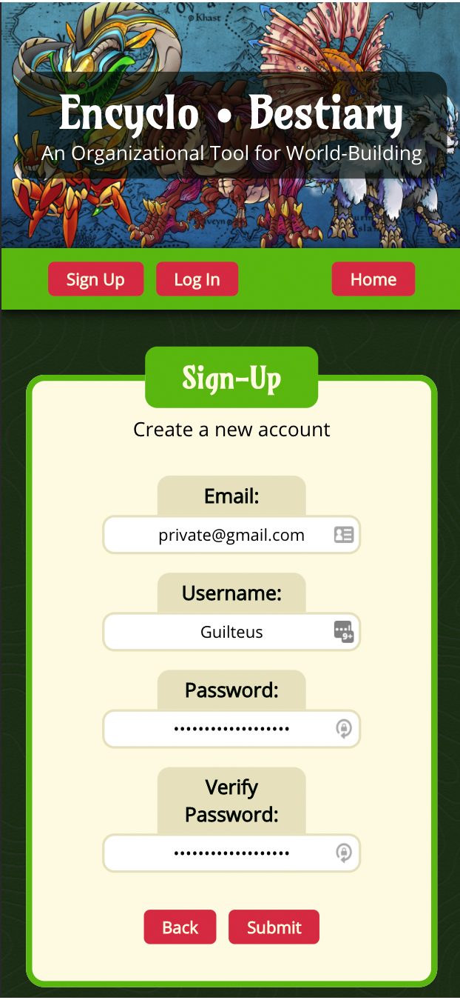
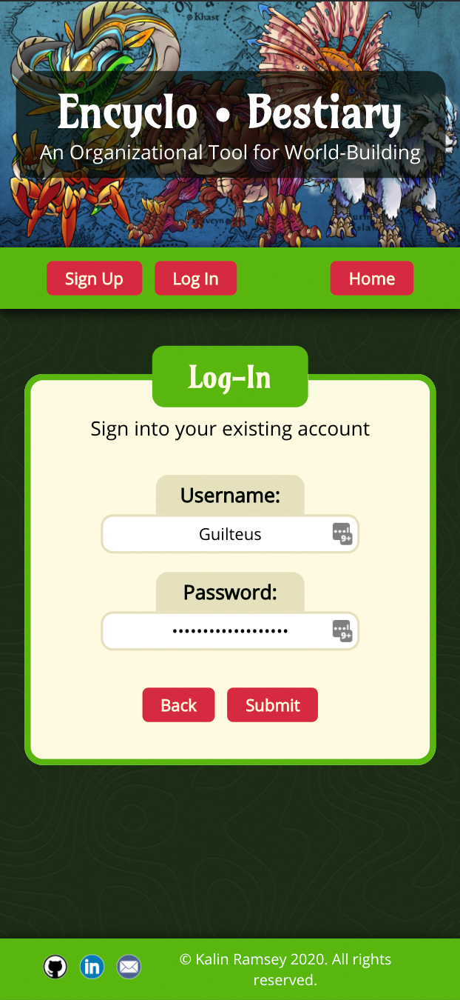
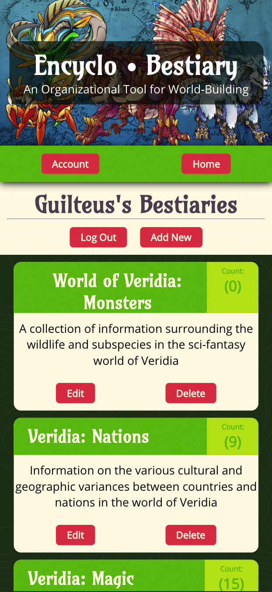
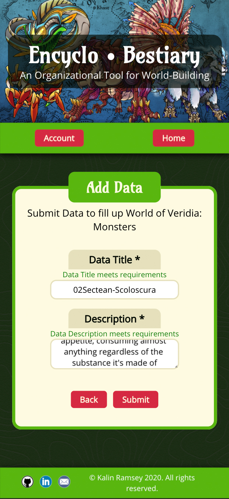

# Encyclo•Bestiary App
[Live Demo](https://encyclo-bestiary-app.kramseyart.vercel.app/)
#### Tech Used:
- ReactJS
- NodeJS
- CSS
#### API:
- [Live API](https://encyclo-bestiary-app.herokuapp.com/)
- [Documentation](https://github.com/KRamseyArt/19.6_EncycloBestiary-API)
#### Summary:
- The landing page displays an informational overview about how to use the application.

- User is able to create a new account by submitting a unique username, along with an email address and validated password.

- Once logged in, user can then freely access their account to create, view, and delete their personal collection of Bestiaries and respective data.

